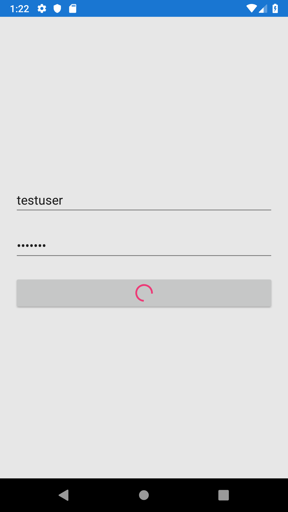

Busy Button
================

This repository demonstrates how to create a custom control in Xamarin.Forms. Here I have created a simple busy button that animates using an activity indicator whenever it is interacted. This lets the user know that some operations are being performed at the background until the activity indicator spins.  

The below XAML demonstrates the code required to configure the custom busy button from the XAML. 

```xaml
<?xml version="1.0" encoding="utf-8" ?>
<ContentPage xmlns="http://xamarin.com/schemas/2014/forms"
             xmlns:x="http://schemas.microsoft.com/winfx/2009/xaml"
             xmlns:d="http://xamarin.com/schemas/2014/forms/design"
             xmlns:mc="http://schemas.openxmlformats.org/markup-compatibility/2006"
             xmlns:control="clr-namespace:BusyButtonDemo.Control"
             xmlns:viewModel="clr-namespace:BusyButtonDemo.ViewModel"
             mc:Ignorable="d"
             x:Class="BusyButtonDemo.MainPage">

    <ContentPage.BindingContext>
        <viewModel:ViewModel />
    </ContentPage.BindingContext>

    <StackLayout Spacing="20" Padding="20" VerticalOptions="Center">
        <Entry Placeholder="Username" Text="{Binding Username}"/>
        <Entry Placeholder="Password" Text="{Binding Password}" IsPassword="true"/>
        <control:BusyButton Text="Login" IsBusy="{Binding IsBusy}" Command="{Binding LoginCommand}"/>
        <Label Text="Login Success" IsVisible="{Binding IsValidLogin}" TextColor="Red" HorizontalTextAlignment="Center" HorizontalOptions="CenterAndExpand"/>
    </StackLayout>
</ContentPage>
```

The output of the busy button working is shown below. 




Author
======
Harikrishnan
